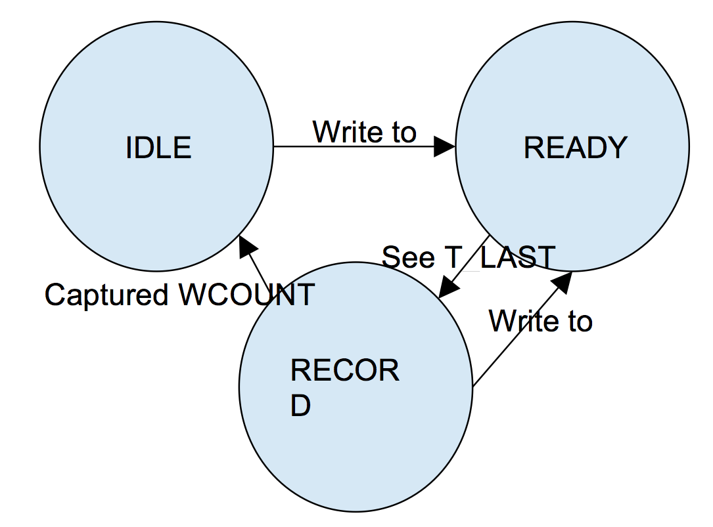

Stream to AXI4 Memory (SAM)
=======================

# Overview

The Stream to AXI4 Memory (SAM) 

# Interface

The SAM uses the DSP streaming interface on input, and the AXI4 interface on the output. 
The host configures the SAM through status and control registers that are memory mapped on the AXI4 interface. 
These registers are:

* __wWriteCount__: Status register indicating the number of words that have been stored since the SAM was triggered. The SAM is no longer storing samples when wWriteCount = wTargetCount. wWriteCount is reset when wStartAddr is written to.
* __wStartAddr__: When triggered, the SAM will store wTargetCount words starting at wStartAddr.
* __wTargetCount__: The next time the SAM is triggered to store samples, it will store wTargetCount samples at addresses from wStartAddr to (wStartAddr - 1)
* __wTrig__: Triggers the SAM to start recording streaming data. Trigger occurs on low to high transition.
* __wWaitForSync__: When true, the SAM waits for the first Sync signal before recording data. When false, it starts recording when wTrig goes high.
* __wPacketCount__: Indicates number of packets stored since the last time the SAM was triggered (i.e. the number of times sync (T_LAST) was seen, plus one for the initial data set).
* __wSyncAddr__: Gives the address at which the first packet start is known from the last time the SAM was triggered (i.e. the address written to the cycle after the first sync appears, or zero when no sync signal appears).

# Parameters

* __subpackets__: number of data subpackets that are time-multiplexed on the streaming interface input
* __bufferDepth__: number of packets to store
* __W__: the width of the streaming data interface (will be expanded to be an integer multiple of the AXI4 crossbar interface width).
* __B__: base address for the SAM

# Behavior

The SAM has three states: IDLE, READY, and RECORD.
The SAM comes out of reset in state IDLE.

The host writing to wTrig, moving it from low to high, puts the SAM in the READY state if wWaitForSync is true, otherwise it puts it in the RECORD state. 
When in the READY state, the SAM stays in the READY state until it sees a SYNC signal on the streaming interface. 
Upon seeing a SYNC signal, the SAM begins recording valid samples from the streaming interface on the next cycle.

wPacketCount increments on each SYNC signal received, including the first one seen in the READY state (that moves it to the RECORD state). 
If a SYNC is received on the last sample collected, it does not increment wPacketCount. 
wSyncAddr is set to wStartAddr once the SAM is triggered. 
It remains there if wWaitForSync is true, otherwise it gets the first address written to after the first SYNC signal is received. 
If no SYNC signal is received, it will remain at wStartAddr. 
You will know if no SYNC signal is received because wPacketCount will be zero.

In the RECORD state, when the data on the streaming interface is valid, it is stored in the memory at the location corresponding to the address (wStartAddr + wWriteCount) % memoryDepth (writing loops around back to address 0, but wWriteCount can never be larger than the memoryDepth, so one cannot record more than the memory size per triggering). 
wWriteCount is incremented on every valid sample on the streaming interface. 
When wWriteCount == wTargetCount, wWriteCount samples have been stored into the memory and the SAM returns to the IDLE state. 
Note that this may occur in the middle of a packet.

The suggested use is to use wWaitForSync for packeted data, then set wTargetCount to a multiple of the number of subpackets. 
This will store exactly that many subpackets (check that wPacketCount is that number), with wSyncAddr being your indicated starting address (wStartAddr). 
If you’d like to grab the first data set before the first SYNC appears, set wWaitForSync to be low. 
Then, wSyncAddr will indicate which address contains the start of the first packet received. 
You may get partial packets at the start and end, depending on what you set wTargetCount to and when wTrig goes high within a packet. 
Check wPacketCount for a count of how many SYNC signals were received. 
If this is 2 or greater, you definitely have at least one complete packet.

When using the SAM for not packeted data, set wWaitForSync to be false. 
Then set wTargetCount to however many cycles of streaming data you’d like to record. 
If a SYNC signal occurs during recording, you’ll know because wPacketCount will increase and wSyncAddr will change. 
Otherwise, wSyncAddr will remain at wStartAddr.

# Implementation

## Parameters

TODO

# Usage

The host writes to wStartAddr, wTargetCount, and wWaitForSync. 
Then the host writes to wTrig to trigger collection of data. 
You can watch the status (if it’s slow) through the status registers. 
After wWriteCount == wTargetCount, the SAM is done collected streaming data. 
Data from wStartAddr to (wStartAddr + wTargetCount), wrapping around, is valid. 
Use the AXI4 interface from the crossbar to grab data from the SAM. 

For now, the memory is dual-ported for simplicity. 
It’s up to the user to ensure the reading is done only after the writing has finished.

